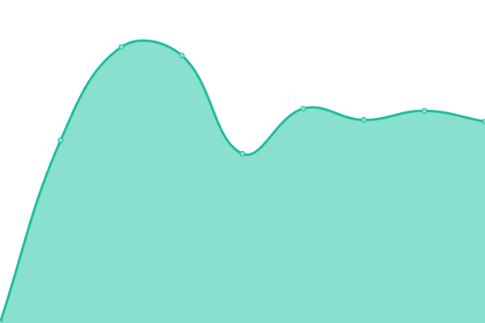
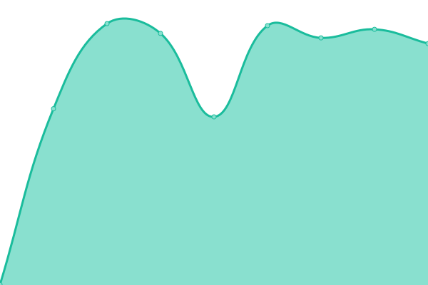
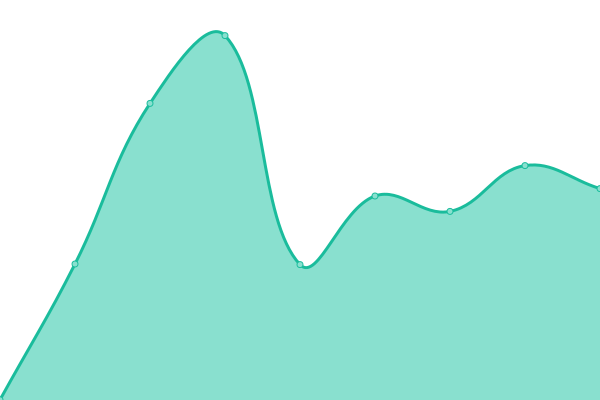
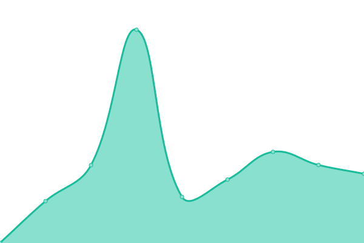

# [📈 Live Status](https://status.silentsoft.org): <!--live status--> **🟩 All systems operational**

This repository contains the open-source uptime monitor and status page for [Hyesung Lee](https://silentsoft.org), powered by [Upptime](https://github.com/upptime/upptime).

With [Upptime](https://upptime.js.org), you can get your own unlimited and free uptime monitor and status page, powered entirely by a GitHub repository. We use [Issues](https://github.com/silentsoft/status.silentsoft.org/issues) as incident reports, [Actions](https://github.com/silentsoft/status.silentsoft.org/actions) as uptime monitors, and [Pages](https://status.silentsoft.org) for the status page.

<!--start: status pages-->
<!-- This summary is generated by Upptime (https://github.com/upptime/upptime) -->
<!-- Do not edit this manually, your changes will be overwritten -->
<!-- prettier-ignore -->
| URL | Status | History | Response Time | Uptime |
| --- | ------ | ------- | ------------- | ------ |
|  [Central Server](https://silentsoft.org) | 🟩 Up | [central-server.yml](https://github.com/silentsoft/status.silentsoft.org/commits/HEAD/history/central-server.yml) | 

 2074ms
     
 | 

<a href="https://status.silentsoft.org/history/central-server">100.00%</a>
    

|  [Actlist](https://actlist.io) | 🟩 Up | [actlist.yml](https://github.com/silentsoft/status.silentsoft.org/commits/HEAD/history/actlist.yml) | 

 673ms
     
 | 

<a href="https://status.silentsoft.org/history/actlist">100.00%</a>
    

|  [Blog](https://blog.silentsoft.org) | 🟩 Up | [blog.yml](https://github.com/silentsoft/status.silentsoft.org/commits/HEAD/history/blog.yml) | 

 1214ms
     
 | 

<a href="https://status.silentsoft.org/history/blog">100.00%</a>
    

|  [Nexus](https://nexus.silentsoft.org) | 🟩 Up | [nexus.yml](https://github.com/silentsoft/status.silentsoft.org/commits/HEAD/history/nexus.yml) | 

 2001ms
     
 | 

<a href="https://status.silentsoft.org/history/nexus">100.00%</a>
    

|  Portfolio | 🟩 Up | [portfolio.yml](https://github.com/silentsoft/status.silentsoft.org/commits/HEAD/history/portfolio.yml) | 

 1214ms
     
 | 

<a href="https://status.silentsoft.org/history/portfolio">100.00%</a>
    

|  API Endpoint | 🟩 Up | [api-endpoint.yml](https://github.com/silentsoft/status.silentsoft.org/commits/HEAD/history/api-endpoint.yml) | 

 996ms
     
 | 

<a href="https://status.silentsoft.org/history/api-endpoint">100.00%</a>
    

<!--end: status pages-->

[**Visit our status website →**](https://status.silentsoft.org)

## 📄 License

- Powered by: [Upptime](https://github.com/upptime/upptime)
- Code: [MIT](./LICENSE) © [Hyesung Lee](https://silentsoft.org)
- Data in the `./history` directory: [Open Database License](https://opendatacommons.org/licenses/odbl/1-0/)
